# Tablero Visual: Flujo de una Orden en Columnas (Kudos DOES™)

> **Diseño optimizado sin cortes de texto**: Cada caja contiene títulos limpios de una sola línea para garantizar que ningún visor corte el texto ni muestre caracteres raros.

---

## 📋 Diagrama por Columnas (Estilo Kanban)

```mermaid
flowchart LR
    %% Clases de estilo con los colores oficiales de Kudos DOES
    classDef cEntrante fill:#fff7ed,stroke:#f97316,stroke-width:2px,color:#9a3412;
    classDef cDiseno fill:#ecfeff,stroke:#0891b2,stroke-width:2px,color:#155e75;
    classDef cToday fill:#fffbeb,stroke:#f59e0b,stroke-width:2px,color:#92400e;
    classDef cCamila fill:#faf5ff,stroke:#a855f7,stroke-width:2px,color:#6b21a8;
    classDef cCliente fill:#f0f9ff,stroke:#2563eb,stroke-width:2px,color:#1e40af;
    classDef cProd fill:#fdf2f8,stroke:#db2777,stroke-width:2px,color:#9d174d;
    classDef cHold fill:#f1f5f9,stroke:#64748b,stroke-width:1.5px,color:#334155;

    %% 1. ENTRADA
    subgraph COL1 ["1. ENTRADA 🟧"]
        direction TB
        A1["📥 Nueva Orden"]
        A2{"¿Datos Listos?"}
        A_BLOCK["🟧 Bloqueada"]:::cEntrante
        A_OK["✅ Lista para Asignar"]:::cDiseno

        A1 --> A2
        A2 -- "Falta algo" --> A_BLOCK
        A2 -- "Completo" --> A_OK
        A_BLOCK -.->|"Resuelto"| A_OK
    end

    %% 2. EN COLA
    subgraph COL2 ["2. EN COLA 🎨"]
        direction TB
        B1["🩷 Fila Euralíz"]:::cDiseno
        B2["🟢 Fila Adrián"]:::cDiseno
        B3["🔵 Fila César"]:::cDiseno
    end

    %% 3. HOY
    subgraph COL3 ["3. HOY 🟡"]
        direction TB
        C1["🟡 TO DO TODAY"]:::cToday
        C2["Reversión Fin de Día"]:::cHold
        C1 -.-> C2
    end

    %% 4. REVISIONES
    subgraph COL4 ["4. REVISIONES 🔍"]
        direction TB
        D1["🟣 Revisión Camila"]:::cCamila
        D2["🔵 En el Cliente"]:::cCliente
        D_HOLD["🪨 ON HOLD (Pausa)"]:::cHold

        D1 -->|"Aprobado"| D2
        D2 -.->|"Sin respuesta"| D_HOLD
    end

    %% 5. PRODUCCIÓN
    subgraph COL5 ["5. PRODUCCIÓN 🚀"]
        direction TB
        E1["✅ Botón APPROVED"]:::cToday
        E2["🩷 EN PRODUCCIÓN"]:::cProd
        E3["⚪ ARCHIVED"]:::cHold

        E1 --> E2
        E2 --> E3
    end

    %% Conexiones entre columnas (Izquierda a Derecha)
    A_OK --> B1
    A_OK --> B2
    A_OK --> B3

    B1 --> C1
    B2 --> C1
    B3 --> C1

    C1 --> D1
    D2 --> E1

    %% Rutas de retorno (Líneas punteadas)
    D1 -.->|"Ajustes Camila"| C1
    D2 -.->|"Cambios Cliente"| C1
    D_HOLD -.->|"Reactivado"| C1
    C2 -.->|"Al amanecer"| B1
```

---

## 🗂️ Detalle de las 5 Columnas (Lectura Rápida)

Para ver todos los detalles de cada columna sin depender de que el visor de diagramas corte las letras:

### 🟧 Columna 1: ENTRADA (`ENTRANTE`)
- **Color**: Naranja (`#f97316`)
- **¿Qué pasa?**: La orden entra desde Trello o creación manual. Si tiene 7 días o menos de creada, se dispara la tarea obligatoria **"Enviar correo de bienvenida"**.
- **Si falta algo**: Si no hay medidas confirmadas, logo o presupuesto aprobado, se marca como **`BLOQUEADA`** (Naranja) con una tarea urgente de **2 días** para conseguir los datos antes de diseñar.

---

### 🎨 Columna 2: EN COLA (`ORDERS RECEIVED`)
- **Color**: 🩷 Fucsia (Euralíz) | 🟢 Verde (Adrián) | 🔵 Cian (César)
- **¿Qué pasa?**: La orden tiene todos sus datos y medidas completos. Está en la fila personal del diseñador asignado esperando su turno.
- **Tiempo base**: **3 días laborables** para emitir la primera propuesta visual.

---

### 🟡 Columna 3: TRABAJANDO HOY (`TO DO TODAY`)
- **Color**: Amarillo Ámbar (`#f59e0b`)
- **¿Qué pasa?**: El diseñador tiene la orden abierta en su mesa de trabajo hoy. Aquí se crea el diseño o se aplican los cambios solicitados.
- **Regla del fin de jornada**: Si termina el día y la orden no se marcó como terminada (`Done`), regresa automáticamente a la cola del diseñador para que el tablero de hoy vuelva a amanecer limpio.

---

### 🔍 Columna 4: REVISIÓN Y CLIENTE (`CAMILA` / `CLIENTE` / `ON HOLD`)
- **Color**: 🟣 Púrpura (Camila) | 🔵 Azul Cielo (Cliente) | 🪨 Gris (Pausa)
- **¿Qué pasa?**:
  1. **Revisión Interna (Camila)**: Se verifica ortografía y calidad. Si pide ajustes, regresa a la Columna 3.
  2. **Envío al Cliente**: Se manda la prueba al cliente.
     - **Si pide cambios**: Regresa a la Columna 3 y el diseñador recibe **+2 días laborables** para ajustarlo.
     - **Si no contesta**: El sistema envía recordatorios automáticos en los días 3, 6 y 9.
     - **Si pasan más de 9 días**: Pasa a **`ON HOLD`** (Gris) y se asigna al equipo de Atención al Cliente para contactarlo por teléfono.

---

### 🚀 Columna 5: PRODUCCIÓN Y ARCHIVO (`EN PRODUCCIÓN` / `ARCHIVED`)
- **Color**: 🩷 Rosa / Alta (`#8b5cf6` / `#ec4899`) | ⚪ Gris Neutro (`#94a3b8`)
- **¿Qué pasa?**:
  1. El usuario hace clic en el botón verde **`APPROVED`**.
  2. El sistema valida dos puntos obligatorios: **¿Medidas confirmadas?** y **¿Estimado aprobado?**.
  3. Al confirmar ambos, se activa un plazo express de **24 horas** con subestatus **`PONER EN ALTA`**.
  4. El diseñador exporta los archivos finales en alta resolución para imprenta o corte.
  5. La orden pasa a **`EN PRODUCCIÓN`** (taller) y finalmente a **`ARCHIVED`** cuando se entrega el trabajo.
