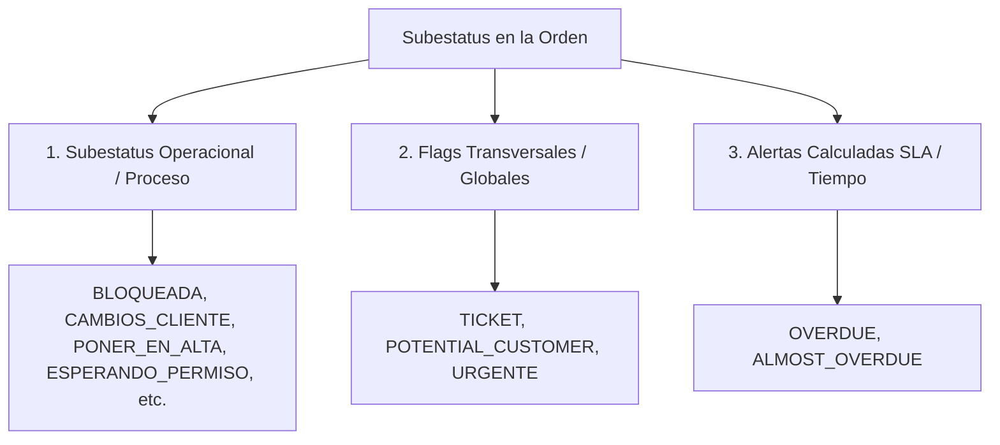

# Plan de Implementación Técnica: Reorganización de Core Status y Subestatus

Este documento establece el plan de trabajo detallado y paso a paso para implementar la jerarquía y estandarización entre `CoreStatus` y `Substatus` en todo el proyecto **KUDOSDOES**.

---

## ⚙️ 1. Arquitectura y Mecanismo de Subestatus

Los subestatus en el sistema funcionan bajo tres categorías claramente definidas:



1. **Subestatus Operacionales / Proceso**: Exclusivos según la fase del trabajo (`CoreStatus`). Indican el motivo operativo actual (ej. `CAMBIOS_CLIENTE`, `PONER_EN_ALTA`, `ESPERANDO_PERMISO`).
2. **Flags / Subestatus Transversales**: Badges globales independientes de la fase que aplican a toda la orden (ej. `TICKET`, `POTENTIAL_CUSTOMER`, `URGENTE`).
3. **Alertas Calculadas por SLA**: Capa visual de advertencia por tiempo expirado (`OVERDUE`, `ALMOST_OVERDUE`) gestionada por `SlaEngine` sin borrar el subestatus operacional de negocio.

---

## 📌 2. Catálogo de los 10 Core Status y sus Subestatus Relacionados

| Core Status | Label Visual | Subestatus Pertenecientes (Válidos) | Subestatus por Defecto | Descripción y Disparadores |
| :--- | :--- | :--- | :--- | :--- |
| **`1. ENTRANTE`** | BLOCKED / Entrada | • `BLOQUEADA`<br>• `FALTA_APROBACION_ESTIMADO`<br>• `PONER_EN_ALTA` | `BLOQUEADA` | Órdenes en cola de entrada con datos pendientes (medidas, estimado, etc.). |
| **`2. EURALIZ_ORDERS_RECEIVED`** | Euralíz Orders | • `PONER_EN_ALTA`<br>• `AJUSTES_PRODUCCION` | *(Estado Limpio)* | Cola de diseño asignada a Euralíz. Diseñador puede marcar `PONER_EN_ALTA`. |
| **`3. ADRIAN_ORDERS_RECEIVED`** | Adrián Orders | • `PONER_EN_ALTA`<br>• `AJUSTES_PRODUCCION` | *(Estado Limpio)* | Cola de diseño asignada a Adrián. Diseñador puede marcar `PONER_EN_ALTA`. |
| **`4. CESAR_ORDERS_RECEIVED`** | César Orders | • `PONER_EN_ALTA`<br>• `AJUSTES_PRODUCCION` | *(Estado Limpio)* | Cola de diseño asignada a César. Diseñador puede marcar `PONER_EN_ALTA`. |
| **`5. TO_DO_TODAY`** | Working Today | • `CAMBIOS_CLIENTE`<br>• `CAMBIOS_CAMILA`<br>• `AJUSTES_PRODUCCION`<br>• `PONER_EN_ALTA` | *(Ninguno)* | Órdenes trabajadas hoy. Incluye la atención a `CAMBIOS_CLIENTE` durante el día. |
| **`6. ENVIADO_A_CAMILA`** | Sent to Camila | • `CAMBIOS_CAMILA` | `CAMBIOS_CAMILA` | Diseños en revisión interna o aprobación por Camila. |
| **`7. ENVIADO_AL_CLIENTE`** | Sent to Client | • `WAITING_FOR_CLIENT`<br>• `CAMBIOS_CLIENTE`<br>• `NO_RESPUESTA` | `WAITING_FOR_CLIENT` | Propuesta/arte enviado al cliente en espera de retroalimentación o aprobación. |
| **`8. ON_HOLD`** | On Hold | • `PAUSADO`<br>• `ESPERANDO_PERMISO`<br>• `CUSTOMER_SERVICE_REQUIRED` | `PAUSADO` | Orden pausada por solicitud del cliente, licencias/permisos o servicio al cliente. |
| **`9. EN_PRODUCCION`** | In Production | • `ENVIADO_EN_ALTA`<br>• `AJUSTES_PRODUCCION` | `ENVIADO_EN_ALTA` | Arte aprobado enviado en alta resolución a taller/fabricación. |
| **`10. ARCHIVED`** | Archived | *(Ninguno)* | *(Ninguno)* | Orden completada o archivada definitivamente. |

---

## 🌐 3. Subestatus Transversales / Globales

| Subestatus Transversal | Categoría | Core Status Aplicables | Comportamiento en el Sistema |
| :--- | :--- | :--- | :--- |
| **`TICKET`** | Global Workflow | Todos los Core Status | Indica que toda la orden representa un ticket de servicio/diseño completo de inicio a fin. |
| **`POTENTIAL_CUSTOMER`** | Clasificación Comercial | Todos excepto `ARCHIVED` | Identifica órdenes pertenecientes a clientes potenciales o prospectos en negociación. |
| **`URGENTE`** | Flag / Prioridad Alta | Todos excepto `ARCHIVED` | Se muestra como badge rojo con animación pulse sin sustituir el subestatus operacional. |
| **`OVERDUE`** | Alerta de Tiempo (SLA) | Todos los estados activos | Calculado dinámicamente por `SlaEngine` cuando la fecha límite ha expirado. |
| **`ALMOST_OVERDUE`** | Alerta de Tiempo (SLA) | Todos los estados activos | Calculado dinámicamente por `SlaEngine` cuando falta menos del umbral de tolerancia. |

---

## 📝 4. Tareas por Fase y Archivos Afectados

### Fase 1: Capa de Datos & Migraciones (Database & Models)

- [ ] **1.1. Crear Migración de Base de Datos**
  - **Comando**: `php artisan make:migration add_core_status_and_is_default_to_substatuses_table`
  - **Campos a agregar**:
    - `core_status` (`string`, `nullable()`, `index()`)
    - `is_default` (`boolean`, `default(false)`)
    - `is_global` (`boolean`, `default(false)`)
  - **Archivo**: `database/migrations/2026_09_28_XXXXXX_add_core_status_and_is_default_to_substatuses_table.php`

- [ ] **1.2. Actualizar Modelo `App\Models\Substatus`**
  - **Archivo**: [`app/Models/Substatus.php`](file:///Users/euriz/Documents/www/KUDOSDOES/app/Models/Substatus.php)
  - **Cambios**:
    - Agregar `core_status`, `is_default`, `is_global` a `$fillable` y `$casts` (`core_status => CoreStatus::class`).
    - Añadir scopes: `scopeForCoreStatus($query, CoreStatus $status)`, `scopeDefault($query)`, `scopeGlobal($query)`.

- [ ] **1.3. Actualizar Enums `CoreStatus` y `Substatus`**
  - **Archivos**:
    - [`app/Enums/CoreStatus.php`](file:///Users/euriz/Documents/www/KUDOSDOES/app/Enums/CoreStatus.php)
    - [`app/Enums/Substatus.php`](file:///Users/euriz/Documents/www/KUDOSDOES/app/Enums/Substatus.php)
  - **Métodos a incorporar**:
    - Incluir nuevos casos `POTENTIAL_CUSTOMER` y `ESPERANDO_PERMISO` en `Substatus` enum.
    - `CoreStatus::validSubstatuses()`: Retorna lista de subestatus permitidos.
    - `CoreStatus::defaultSubstatus()`: Retorna el subestatus por defecto para ese estado core.
    - `Substatus::isGlobal()`: Verifica si el subestatus es transversal.

- [ ] **1.4. Actualizar Seeder `SubstatusSeeder`**
  - **Archivo**: [`database/seeders/SubstatusSeeder.php`](file:///Users/euriz/Documents/www/KUDOSDOES/database/seeders/SubstatusSeeder.php)
  - Actualizar los registros iniciales para poblar los campos `core_status`, `is_default` e `is_global` (incluyendo `TICKET`, `POTENTIAL_CUSTOMER`, `ESPERANDO_PERMISO`, `PONER_EN_ALTA`).

---

### Fase 2: Servicio Centralizado de Transición de Estados (`StatusTransitionService`)

- [ ] **2.1. Crear Servicio de Transición de Estado**
  - **Comando**: `php artisan make:class Services/StatusTransitionService`
  - **Archivo**: `app/Services/StatusTransitionService.php`
  - **Métodos**:
    ```php
    public function getValidSubstatuses(CoreStatus $coreStatus): Collection;
    public function getDefaultSubstatus(CoreStatus $coreStatus): ?Substatus;
    public function handleCoreStatusChange(Order $order, CoreStatus $newCoreStatus): void;
    ```
  - **Comportamiento**:
    - Si el subestatus actual de la orden no pertenece a `$newCoreStatus` ni es `is_global`, se actualiza automáticamente al `defaultSubstatus` del nuevo `CoreStatus` (o `null` si el estado core no requiere subestatus).

- [ ] **2.2. Integrar Servicio en `AutomationEngine` & Observers**
  - **Archivos**:
    - [`app/Services/AutomationEngine.php`](file:///Users/euriz/Documents/www/KUDOSDOES/app/Services/AutomationEngine.php)
    - [`app/Observers/OrderObserver.php`](file:///Users/euriz/Documents/www/KUDOSDOES/app/Observers/OrderObserver.php)
  - Asegurar que al cambiar `core_status` mediante automatización o sync de Trello se invoque `handleCoreStatusChange`.

---

### Fase 3: Componentes Livewire y Vistas de Usuario

- [ ] **3.1. Modal de Detalle de Orden (`OrderDetailModal`)**
  - **Archivos**:
    - [`app/Livewire/Orders/OrderDetailModal.php`](file:///Users/euriz/Documents/www/KUDOSDOES/app/Livewire/Orders/OrderDetailModal.php)
    - [`resources/views/livewire/orders/order-detail-modal.blade.php`](file:///Users/euriz/Documents/www/KUDOSDOES/resources/views/livewire/orders/order-detail-modal.blade.php)
  - **Cambios**:
    - Al cambiar `core_status` en el formulario de edición, filtrar dinámicamente el selector de `substatus` reactivamente en Alpine/Livewire.
    - Incluir siempre los subestatus transversales (`TICKET`, `POTENTIAL_CUSTOMER`, `URGENTE`).
    - Asignar automáticamente el subestatus por defecto cuando el usuario cambia el estado core.

- [ ] **3.2. Modal de Creación de Orden (`CreateOrderModal`)**
  - **Archivos**:
    - [`app/Livewire/Orders/CreateOrderModal.php`](file:///Users/euriz/Documents/www/KUDOSDOES/app/Livewire/Orders/CreateOrderModal.php)
    - [`resources/views/livewire/orders/create-order-modal.blade.php`](file:///Users/euriz/Documents/www/KUDOSDOES/resources/views/livewire/orders/create-order-modal.blade.php)
  - **Cambios**:
    - Filtrar las opciones de subestatus según el `core_status` seleccionado más los subestatus transversales.

- [ ] **3.3. Tablero Kanban y Planificador Semanal (`Kanban\Board` & `WeeklyPlanner`)**
  - **Archivos**:
    - [`app/Livewire/Kanban/Board.php`](file:///Users/euriz/Documents/www/KUDOSDOES/app/Livewire/Kanban/Board.php)
    - [`app/Livewire/Planner/WeeklyPlanner.php`](file:///Users/euriz/Documents/www/KUDOSDOES/app/Livewire/Planner/WeeklyPlanner.php)
  - **Cambios**:
    - Al arrastrar y soltar (drag & drop) una orden entre columnas de `CoreStatus`, llamar a `handleCoreStatusChange()` para reajustar su subestatus.

- [ ] **3.4. Pantalla de Ajustes de Subestatus (`Settings\Substatuses`)**
  - **Archivos**:
    - [`app/Livewire/Settings/Substatuses.php`](file:///Users/euriz/Documents/www/KUDOSDOES/app/Livewire/Settings/Substatuses.php)
    - [`resources/views/livewire/settings/substatuses.blade.php`](file:///Users/euriz/Documents/www/KUDOSDOES/resources/views/livewire/settings/substatuses.blade.php)
  - **Cambios**:
    - Agregar inputs para asignar el `CoreStatus` perteneciente y la casilla para marcar si es el subestatus por defecto o es global/transversal.

---

### Fase 4: Pruebas Unitarias y de Integración (Testing & QA)

- [ ] **4.1. Crear Tests para `StatusTransitionService`**
  - **Comando**: `php artisan make:test StatusTransitionServiceTest`
  - Validar que cambiar de `ENTRANTE` a `ENVIADO_AL_CLIENTE` ajusta el subestatus a `WAITING_FOR_CLIENT`.
  - Validar que los subestatus globales (`TICKET`, `POTENTIAL_CUSTOMER`, `URGENTE`) se mantienen tras cambiar de `CoreStatus`.

- [ ] **4.2. Actualizar Tests Existentes de Subestatus y Automatizaciones**
  - **Comando**: `php artisan test --compact --filter=Substatus`
  - **Comando**: `php artisan test --compact --filter=AutomationEngine`
  - Correr la suite completa de pruebas para verificar que no haya regresiones: `php artisan test --compact`.

---

## 🧪 5. Matriz de Verificación y Criterios de Aceptación

1. **Creación/Edición en Ajustes**:
   - Se puede crear un nuevo subestatus asociándolo a un `CoreStatus` o como transversal (`is_global`) y guardarlo en DB.
2. **Filtrado en Dropdowns UI**:
   - En los modales de orden, los subestatus transversales (`TICKET`, `POTENTIAL_CUSTOMER`, `URGENTE`) siempre están disponibles, mientras que los operacionales cambian según el `CoreStatus`.
3. **Subestatus de Diseñador**:
   - En las colas de diseñador (`EURALIZ`, `ADRIAN`, `CESAR`), la opción `PONER_EN_ALTA` está disponible cuando concluyen el diseño.
4. **Respeto a Alertas SLA**:
   - Las órdenes vencidas muestran el badge visual de `OVERDUE` sin eliminar el subestatus operacional de negocio de la base de datos.
