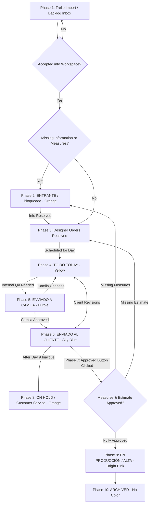

# Kudos Design Ops — Order Workflow & Timeline Documentation

## 1. Executive Summary & Business Context

**Kudos Design Ops** is an operational management and automation layer built for the Kudos Graphic Design Team. 

The primary business goal of the platform is to transform raw Trello card activity into a structured, SLA-governed design pipeline. Trello acts as the team's operational board, while this application interprets card movements, enforces business Service Level Agreements (SLAs), triggers automated customer communication tasks, manages workflow conditions, tracks metrics, and maintains an immutable audit timeline.

### Design Team Structure & Color Identity
The team consists of three primary designers and external support:
- **Euralíz** (Lead / Senior Designer) — **🩷 Bright Pink**
- **Adrián** (Designer) — **🟢 Green**
- **César** (Designer) — **🔵 Sky Blue**
- **External Designers** — **🟡 Yellow**

### Core Operational Question
The entire workflow is optimized to answer one continuous question for the team and management:
> **"What needs attention today, why is it delayed or blocked, and who is responsible?"**

---

## 2. Order Structure & Trello Ingestion

An **Order** in Kudos Design Ops represents a single client request (**1 Trello Card = 1 Order**).

```
┌────────────────────────────────────────────────────────────────────────┐
│                        Trello Card Title                               │
│        "WO 16253 LA CHAPINA BAKERY ( MARCELA ) - BANNER DESIGN"        │
└──────────────────────────────────┬─────────────────────────────────────┘
                                   │
                                   ▼
                    OrderTitleParserService
                                   │
      ┌────────────────────────────┼────────────────────────────┐
      ▼                            ▼                            ▼
  WO Number                  Company Name                Task Name
 "WO 16253"              "LA CHAPINA BAKERY"         "BANNER DESIGN"
                                   │
                                   ▼
                           Responsible Person
                               "MARCELA"
```

### 2.1 Card Title Parsing
When a card is created or updated in Trello, the `OrderTitleParserService` parses standard title formats into structured database attributes:
* **WO Number**: Extracted work order identifier (e.g., `WO 16253`).
* **Company Name**: Client or brand name (e.g., `LA CHAPINA BAKERY`).
* **Responsible Person**: Account manager or client contact extracted from parentheses e.g. `(MARCELA)`.
* **Task Name**: Description of the requested design deliverable.

*Administrative header cards (such as "TO DO TODAY", "REVISAR CON GABY", "César", "Euralíz") are automatically identified and excluded from order processing.*

### 2.2 System Architecture: Two-Tier Storage
Orders exist in one of two main spaces within the system:
1. **Backlog Inbox (`in_workspace = false`)**: Newly imported Trello cards enter the Backlog inbox first. They do not clutter active designer queues or affect work-in-progress (WIP) limits until explicitly reviewed and accepted by a team member.
2. **Active Workspace (`in_workspace = true`)**: Orders currently being actively managed, scheduled, designed, reviewed, or delivered across Kanban boards and daily planners.

---

## 3. Order Stages (Core Statuses & Color Palette)

Core Statuses define **where an order is in its lifecycle**. The system maintains exact mapping between app statuses, colors, and Trello lists.

| Core Status | Trello List Mapping | Color Theme | Description / Meaning | Clock Status |
| :--- | :--- | :--- | :--- | :--- |
| `ENTRANTE` | `ENTRANTE` | 🟧 **Orange** | Order created or imported, but blocked/incomplete (missing measures, logos, or specifications). | **SLA Running** (2 Days) |
| `EURALIZ ORDERS RECEIVED` | `Euraliz Orders Received` | 🩷 **Bright Pink** | Ready to be scheduled into Euralíz's weekly work plan. | **SLA Running** (3 Days) |
| `ADRIAN ORDERS RECEIVED` | `Adrian Orders Received` | 🟢 **Green** | Ready to be scheduled into Adrián's weekly work plan. | **SLA Running** (3 Days) |
| `CESAR ORDERS RECEIVED` | `Cesar Orders Received` | 🔵 **Sky Blue** | Ready to be scheduled into César's weekly work plan. | **SLA Running** (3 Days) |
| `TO DO TODAY` | `TO DO TODAY` | 🟡 **Yellow** | High-priority queue scheduled for active design work **today**. | **SLA Running** |
| `ENVIADO A CAMILA` | `ENVIADO A CAMILA` | 🟣 **Purple** | Design draft completed and sent to Camila for internal QA. | **SLA Running** (Does NOT pause) |
| `ENVIADO AL CLIENTE` | `ENVIADO AL CLIENTE` | 🔵 **Sky Blue** | Design delivered to client. Awaiting client feedback or approval. | **SLA Paused** (Client Time) |
| `ON HOLD` | `ON HOLD` | 🟧 **Orange** | Paused due to client non-response (>9 days, CS required) or manual user pause. | **SLA Paused** |
| `EN PRODUCCIÓN` | `EN PRODUCCIÓN` | 🩷 **Bright Pink** | Approved design sent for final production, printing, or high-res export (ALTA). | **Completed** |
| `ARCHIVED` | N/A | ⚪ **No Color** | Order completed, closed, and stored in history. | **Closed** |

---

## 4. End-to-End Order Workflow Timeline

The complete lifecycle of an order from initial creation in Trello to final archiving consists of **10 distinct operational phases**:



### Phase 1: Creation & Ingestion (Trello -> Backlog Inbox)
1. Card created on Trello board.
2. System ingests card via `TrelloSyncService`.
3. Checks if card is new:
   - Sets `is_new_from_trello = true` and `in_workspace = false`.
   - **Welcome Email Trigger Rule**: `AutomationEngine` triggers mandatory **Enviar correo de bienvenida** task assigned to primary designer **ONLY IF** the Trello creation date (`trello_created_at`) is **no older than 1 week (7 days)**.
   - Calculates initial due date based on stage (3 business days standard).
   - Event logged: `ORDER_CREATED`.

### Phase 2: Incomplete / Blocked Intake (`ENTRANTE` — 🟧 Orange)
1. **How the System Knows Info is Missing**:
   - **Approval Workflow Flag**: If a user clicks **APPROVED** but sets `Measures Confirmed = NO`, the system automatically detects missing measures, sets `core_status = ENTRANTE`, `substatus = BLOQUEADA`, and `blocking_reason = FALTAN MEDIDAS`.
   - **Manual User Marking**: Team members explicitly set `substatus = BLOQUEADA` with a specific reason (`FALTAN MEDIDAS`, `FALTA LOGO`, or `OTROS`).
   - **Trello Card Ingestion Check**: If essential specs or assets are missing during intake.
2. System auto-creates high-priority **RESOLVER** / **SOLICITAR INFORMACIÓN** task.
3. SLA assigned: **2 business days**. Color theme: 🟧 **Orange**.

### Phase 3: Designer Queue & Scheduling (`ORDERS RECEIVED`)
1. Ready orders enter the designer's queue:
   - **Euralíz**: 🩷 **Bright Pink** (`EURALIZ ORDERS RECEIVED`)
   - **Adrián**: 🟢 **Green** (`ADRIAN ORDERS RECEIVED`)
   - **César**: 🔵 **Sky Blue** (`CESAR ORDERS RECEIVED`)
   - **External**: 🟡 **Yellow**
2. **Base Design SLA**: Maximum **3 business days** to deliver first draft.

### Phase 4: Daily Execution Board (`TO DO TODAY` — 🟡 Yellow)
1. Orders scheduled for the current date are moved into `TO DO TODAY` (🟡 **Yellow**).
2. Designer works on active items and marks subtasks / order completion.
3. **Daily Reversion Automation**: At the end of the working day, any order left in `TO DO TODAY` that is **NOT** marked `done_today = true` is automatically reverted back to the designer's `ORDERS RECEIVED` queue.

### Phase 5: Internal Review (`ENVIADO A CAMILA` — 🟣 Purple)
1. Designer completes draft and moves card to `ENVIADO A CAMILA` (🟣 **Purple**).
2. **Important Rule**: *The design SLA clock continues to run during internal review.*
3. On the next business day, system automatically creates a **Follow Up Camila** subtask:
   - **Due Date is TODAY / Overdue Escalation**: If due date is **today** or past due, task title changes to **"Llamar a Camila"** ("Call Camila"), priority is escalated to **Urgent**, with red alert styling.
   - **Standard Due Date**: Task title is **"Follow Up Camila"**.

### Phase 6: Client Delivery & Revision Loop (`ENVIADO AL CLIENTE` — 🔵 Sky Blue)
1. Design delivered to client; card moved to `ENVIADO AL CLIENTE` (🔵 **Sky Blue**).
2. **Design SLA Pauses**: Active design clock stops; `CLIENT WAITING TIME` tracking begins.
3. **Client Inactivity & Follow-Up Automation**:
   - **Day 3**: `Follow Up Cliente #1`
   - **Day 6**: `Follow Up Cliente #2`
   - **Day 9**: `Follow Up Cliente #3`
   - **After Day 9 (> 9 days)**: Order is automatically moved to `ON HOLD` with 🟧 **Orange** styling (`substatus = CUSTOMER SERVICE REQUIRED` / `NO RESPUESTA` and `customer_service_required = true`).

### Phase 7: Client Approval Workflow (`APPROVED` Button)
When client approves design, user clicks **APPROVED** button. Prompts for *Medidas Confirmadas* and *Estimado Aprobado*:
- **Fully Approved**: Substatus set to `PONER EN ALTA` (🩷 **Bright Pink**).
- **Missing Measures**: Moved to `ENTRANTE` + `substatus = BLOQUEADA` (🟧 **Orange**).
- **Missing Estimate**: Proceeds with `FALTA APROBACIÓN DE ESTIMADO` warning.

### Phase 8: Paused / Customer Service Required (`ON HOLD` — 🟧 Orange)
* **Automatic Path**: After Day 9 without client response -> Moved to `ON HOLD`, `substatus = CUSTOMER SERVICE REQUIRED` (🟧 **Orange**).
* **Manual Path**: User manually moves order to `ON HOLD` -> `substatus = PAUSADO` with mandatory `pause_reason` text field.

### Phase 9: Final Production Delivery (`EN PRODUCCIÓN` / ALTA — 🩷 Bright Pink)
1. Order marked done in `TO DO TODAY` with `substatus = PONER EN ALTA`.
2. System automatically moves order to `EN PRODUCCIÓN` and sets `substatus = ENVIADO EN ALTA` (🩷 **Bright Pink**).

### Phase 10: Archiving (`ARCHIVED` — ⚪ No Color)
1. Order moved to `ARCHIVED`.
2. System populates `archived_at = timestamp`.
3. Displays with neutral / transparent no-color styling to de-emphasize completed historical items.

---

*Documentation updated with official Kudos Design Ops simple color palette.*
