# Plan de Reorganización y Estandarización: Core Status y Subestatus

## 1. Contexto y Funcionamiento Detallado de Subestatus

En el sistema **KUDOSDOES**, el estado del flujo de trabajo de cada orden se gestiona a través de dos dimensiones complementarias: **Core Status** (fase general del pipeline) y **Subestatus** (estado operativo granular, motivo de espera o indicador de acción).

### ⚙️ Mecanismo de Funcionamiento de los Subestatus

Los subestatus operan bajo tres categorías funcionales diferenciadas:

1. **Subestatus Operacionales / de Proceso (Workflow Substatuses)**:
   - Representan la razón exacta por la que la orden está en una fase determinada o qué acción específica requiere.
   - Son mutuamente excluyentes entre sí por cada orden.
   - **Ejemplos**: `BLOQUEADA`, `CAMBIOS_CLIENTE`, `CAMBIOS_CAMILA`, `PONER_EN_ALTA`, `AJUSTES_PRODUCCION`, `WAITING_FOR_CLIENT`, `FALTA_APROBACION_ESTIMADO`, `NO_RESPUESTA`, `PAUSADO`, `ESPERANDO_PERMISO`, `CUSTOMER_SERVICE_REQUIRED`, `ENVIADO_EN_ALTA`.

2. **Flags / Subestatus Transversales (Global Substatuses / Flags)**:
   - Aplican o pueden coexistir independientemente de la fase o estado de la orden (`core_status`). Toda la orden o el proceso puede estar etiquetado con estos subestatus sin importar en qué columna o estado se encuentre.
   - **Ejemplos**: `TICKET` (la orden es un ticket de trabajo completo de inicio a fin), `POTENTIAL_CUSTOMER` (cliente potencial/prospecto), `URGENTE` (atención o prioridad alta).

3. **Alertas Temporales / Calculadas por SLA (Calculated SLA Statuses)**:
   - Indicadores calculados dinámicamente por el motor de SLA (`SlaEngine`) según la fecha límite (`current_due_date`).
   - **Ejemplos**: `OVERDUE` (Vencida) y `ALMOST_OVERDUE` (Casi Vencida).
   - *Mejora clave del plan*: Se convierten en capas/alertas de tiempo sobrepuestas para **no sobrescribir** el subestatus operacional de negocio de la orden.

### 🎨 Renderizado Visual y Paleta de Colores Dinámica
Cada subestatus posee atributos visuales (`bg_color`, `text_color`, `border_color`, `style_type`) administrados dinámicamente mediante el método `Substatus::derivePaletteFromColor()`, el cual genera combinaciones HSL/HEX armónicas automáticamente para mantener una UI limpia y consistente.

---

## 2. Conflictos y Limitaciones Detectadas

| Conflicto / Problema | Descripción | Impacto |
| :--- | :--- | :--- |
| **Desconexión Modelo vs Enum** | `Order::$casts['substatus']` castea directamente a `App\Enums\Substatus::class`. Si un usuario crea un subestatus dinámico en Ajustes (base de datos `substatuses`), **el sistema falla al intentar asignarlo a una orden** porque no existe en el Enum PHP. | Imposibilita la gestión dinámicamente personalizable de subestatus desde la UI. |
| **Sin jerarquía o asociación directa** | No existe vinculación entre `CoreStatus` y `Substatus`. Cualquier subestatus puede seleccionarse técnicamente en cualquier `CoreStatus`. | Desorientación en UI (dropdowns muestran opciones irrelevantes como `CAMBIOS_CAMILA` en `EN_PRODUCCION`). |
| **Sobrescritura por SLA Engine** | `SlaEngine` sobreescribe el campo `substatus` a `OVERDUE` o `ALMOST_OVERDUE`. | Se pierde el subestatus de negocio original (ej. si estaba en `CAMBIOS_CLIENTE`, al vencer pasa a ser `OVERDUE` y se pierde el rastro de que requería cambios de cliente). |
| **Lógica dispersa de automatizaciones** | `AutomationEngine`, `SlaEngine`, `ActionRequiredResolverService`, `OrderDetailModal`, `WeeklyPlanner` y `Kanban\Board` tienen reglas hardcodeadas sobre qué subestatus poner/quitar al cambiar de estado core. | Inconsistencia en transiciones automáticas y duplicación de reglas de negocio. |
| **Mezcla de conceptos (Workflow vs Alertas)** | Conceptos de alerta/tiempo (`OVERDUE`, `ALMOST_OVERDUE`, `URGENTE`) conviven en el mismo campo que estados de proceso (`CAMBIOS_CLIENTE`, `PONER_EN_ALTA`). | Confusión entre el estado real del trabajo y el indicador de urgencia/vencimiento. |

---

## 3. Catálogo Completo de Core Status y Subestatus Relacionados

A continuación se detalla cada uno de los 10 **Core Status** del sistema con la lista exacta de sus subestatus permitidos, su subestatus por defecto al entrar a la fase, y los disparadores automáticos (triggers):

```mermaid
graph TD
    A[Core Status] --> B[1. ENTRANTE / BLOCKED]
    A --> C[2-4. DISEÑO: EURALIZ / ADRIAN / CESAR]
    A --> D[5. TO_DO_TODAY]
    A --> E[6. ENVIADO_A_CAMILA]
    A --> F[7. ENVIADO_AL_CLIENTE]
    A --> G[8. ON_HOLD]
    A --> H[9. EN_PRODUCCION]
    A --> I[10. ARCHIVED]

    B --> B1[BLOQUEADA]
    B --> B2[FALTA_APROBACION_ESTIMADO]
    B --> B3[PONER_EN_ALTA]

    C --> C1[AJUSTES_PRODUCCION]
    C --> C2[PONER_EN_ALTA]

    D --> D1[AJUSTES_PRODUCCION]
    D --> D2[CAMBIOS_CAMILA]
    D --> D3[CAMBIOS_CLIENTE]
    D --> D4[PONER_EN_ALTA]

    E --> E1[CAMBIOS_CAMILA]

    F --> F1[WAITING_FOR_CLIENT]
    F --> F2[CAMBIOS_CLIENTE]
    F --> F3[NO_RESPUESTA]

    G --> G1[PAUSADO]
    G --> G2[ESPERANDO_PERMISO]
    G --> G3[CUSTOMER_SERVICE_REQUIRED]

    H --> H1[ENVIADO_EN_ALTA]
    H --> H2[AJUSTES_PRODUCCION]
```

### 📋 Lista Detallada por Core Status

#### 1. `ENTRANTE` (Entrada / Requiere Acción / Bloqueada)
- **Propósito**: Órdenes que recién ingresan o que están detenidas en el panel Resolver por faltar información crucial antes de pasar a diseño.
- **Subestatus Relacionados**:
  - `BLOQUEADA` *(Por Defecto)*: Falta confirmación de medidas o definición técnica básica.
  - `FALTA_APROBACION_ESTIMADO`: En espera de que el cliente o administración apruebe el presupuesto/estimado.
  - `PONER_EN_ALTA`: La orden fue aprobada o resuelta y está lista para ser enviada a producción/alta.
- **Triggers Automáticos**: Se asigna `BLOQUEADA` automáticamente si la orden se marca sin medidas confirmadas al crearse.

---

#### 2. `EURALIZ_ORDERS_RECEIVED` (En Cola de Diseño - Euralíz)
- **Propósito**: Órdenes listas para diseñar asignadas a la diseñadora Euralíz.
- **Subestatus Relacionados**:
  - `PONER_EN_ALTA`: El diseñador completó el diseño y lo marca listo para producción/alta.
  - `AJUSTES_PRODUCCION`: Corrección requerida tras revisión de taller o alta.
- **Subestatus por Defecto**: *Ninguno (Estado de cola limpio).*

---

#### 3. `ADRIAN_ORDERS_RECEIVED` (En Cola de Diseño - Adrián)
- **Propósito**: Órdenes listas para diseñar asignadas al diseñador Adrián.
- **Subestatus Relacionados**:
  - `PONER_EN_ALTA`: El diseñador completó el diseño y lo marca listo para producción/alta.
  - `AJUSTES_PRODUCCION`: Corrección requerida tras revisión de taller o alta.
- **Subestatus por Defecto**: *Ninguno (Estado de cola limpio).*

---

#### 4. `CESAR_ORDERS_RECEIVED` (En Cola de Diseño - César)
- **Propósito**: Órdenes listas para diseñar asignadas al diseñador César.
- **Subestatus Relacionados**:
  - `PONER_EN_ALTA`: El diseñador completó el diseño y lo marca listo para producción/alta.
  - `AJUSTES_PRODUCCION`: Corrección requerida tras revisión de taller o alta.
- **Subestatus por Defecto**: *Ninguno (Estado de cola limpio).*

---

#### 5. `TO_DO_TODAY` (Trabajando Hoy / En Proceso Activo)
- **Propósito**: Órdenes seleccionadas para ser trabajadas activamente por los diseñadores o el planificador en la jornada del día.
- **Subestatus Relacionados**:
  - `CAMBIOS_CLIENTE`: Modificación o corrección solicitada por el cliente siendo atendida hoy.
  - `CAMBIOS_CAMILA`: Corrección requerida tras revisión interna siendo trabajada hoy.
  - `AJUSTES_PRODUCCION`: Ajuste técnico de taller siendo procesado hoy.
  - `PONER_EN_ALTA`: Finalizando artes para enviar a producción hoy.
- **Subestatus por Defecto**: *Hereda el subestatus de tarea actual o queda limpio.*

---

#### 6. `ENVIADO_A_CAMILA` (En Revisión Interna / Aprobación Camila)
- **Propósito**: El diseño ha sido finalizado por el diseñador y enviado a revisión interna con Camila.
- **Subestatus Relacionados**:
  - `CAMBIOS_CAMILA` *(Por Defecto)*: Indica que el diseño está bajo revisión o requiere ajustes de revisión interna.
- **Triggers Automáticos**: Al mover la orden a `ENVIADO_A_CAMILA`, se asigna automáticamente `CAMBIOS_CAMILA`.

---

#### 7. `ENVIADO_AL_CLIENTE` (En Espera de Respuesta del Cliente)
- **Propósito**: El arte o propuesta ha sido enviada al cliente y se aguarda su aprobación o comentarios.
- **Subestatus Relacionados**:
  - `WAITING_FOR_CLIENT` *(Por Defecto)*: En espera estándar de retroalimentación.
  - `CAMBIOS_CLIENTE`: El cliente respondió solicitando cambios/revisiones en el diseño.
  - `NO_RESPUESTA`: Transcurrió el periodo de tolerancia sin respuesta del cliente (seguimiento automatizado).
- **Triggers Automáticos**: Al enviar prueba al cliente, la orden cambia a `ENVIADO_AL_CLIENTE` con subestatus `WAITING_FOR_CLIENT`.

---

#### 8. `ON_HOLD` (En Pausa Administrativa / Standby)
- **Propósito**: Órdenes pausadas temporalmente por el cliente, esperando licencias o requiriendo atención especial.
- **Subestatus Relacionados**:
  - `PAUSADO` *(Por Defecto)*: Pausada manualmente por el gestor o cliente.
  - `ESPERANDO_PERMISO`: En espera de permisos municipales, de plaza, licencias de marca o autorizaciones externas.
  - `CUSTOMER_SERVICE_REQUIRED`: Requiere intervención de atención al cliente para destrabar la gestión.
- **Triggers Automáticos**: El bot de seguimiento asigna `CUSTOMER_SERVICE_REQUIRED` si tras múltiples avisos el cliente no responde.

---

#### 9. `EN_PRODUCCION` (Aprobada / En Alta / Fabricación)
- **Propósito**: El cliente aprobó el diseño y la orden ingresó al proceso de alta, impresión, fabricación o instalación.
- **Subestatus Relacionados**:
  - `ENVIADO_EN_ALTA` *(Por Defecto)*: Arte enviado en alta resolución a taller/producción.
  - `AJUSTES_PRODUCCION`: Taller solicita una corrección de formato o ajuste técnico.
- **Triggers Automáticos**: Marcar la orden como "Poner en Alta" la traslada automáticamente a `EN_PRODUCCION` con `ENVIADO_EN_ALTA`.

---

#### 10. `ARCHIVED` (Archivada / Finalizada)
- **Propósito**: Órdenes entregadas, cerradas o canceladas definitivamente.
- **Subestatus Relacionados**: *Ninguno.*
- **Subestatus por Defecto**: *Null (Limpio).*

---

## 4. Tabla Resumen de Mapeo de Subestatus por Core Status

| Core Status | Label Visual | Subestatus Pertenecientes (Válidos) | Subestatus por Defecto (Auto-asignado) | Descripción / Propósito del Estado |
| :--- | :--- | :--- | :--- | :--- |
| **`ENTRANTE`** | BLOCKED / Entrada | • `BLOQUEADA` • `FALTA_APROBACION_ESTIMADO` • `PONER_EN_ALTA` | `BLOQUEADA` | Órdenes que ingresan o están detenidas por requerir acción administrativa/resolver (medidas, estimado, etc.). |
| **`EURALIZ_ORDERS_RECEIVED`** | Euralíz Orders | • `PONER_EN_ALTA` • `AJUSTES_PRODUCCION` | *(Ninguno - Estado Limpio)* | Cola de diseño asignada a la diseñadora Euralíz. |
| **`ADRIAN_ORDERS_RECEIVED`** | Adrián Orders | • `PONER_EN_ALTA` • `AJUSTES_PRODUCCION` | *(Ninguno - Estado Limpio)* | Cola de diseño asignada al diseñador Adrián. |
| **`CESAR_ORDERS_RECEIVED`** | César Orders | • `PONER_EN_ALTA` • `AJUSTES_PRODUCCION` | *(Ninguno - Estado Limpio)* | Cola de diseño asignada al diseñador César. |
| **`TO_DO_TODAY`** | Working Today | • `CAMBIOS_CLIENTE` • `CAMBIOS_CAMILA` • `AJUSTES_PRODUCCION` • `PONER_EN_ALTA` | *(Ninguno)* | Órdenes seleccionadas para ser trabajadas activamente durante la jornada de hoy. |
| **`ENVIADO_A_CAMILA`** | Sent to Camila | • `CAMBIOS_CAMILA` | `CAMBIOS_CAMILA` | Diseños terminados enviados a revisión interna / aprobación por Camila. |
| **`ENVIADO_AL_CLIENTE`** | Sent to Client | • `WAITING_FOR_CLIENT` • `CAMBIOS_CLIENTE` • `NO_RESPUESTA` | `WAITING_FOR_CLIENT` | Diseños enviados al cliente en espera de feedback, aprobación o correcciones. |
| **`ON_HOLD`** | On Hold | • `PAUSADO` • `ESPERANDO_PERMISO` • `CUSTOMER_SERVICE_REQUIRED` | `PAUSADO` | Orden pausada por el cliente, permisos pendientes o atención al cliente. |
| **`EN_PRODUCCION`** | In Production | • `ENVIADO_EN_ALTA` • `AJUSTES_PRODUCCION` | `ENVIADO_EN_ALTA` | Orden aprobada lista o en proceso de fabricación, impresión o instalación. |
| **`ARCHIVED`** | Archived | *(Ninguno)* | *(Ninguno)* | Orden completada o archivada de forma definitiva. |

---

## 5. Subestatus Transversales / Globales (Disponibles en Todo el Sistema)

Los subestatus transversales son atributos o etiquetas de clasificación global que se pueden aplicar o consultar independientemente del `CoreStatus` en el que se encuentre la orden:

| Subestatus Transversal | Tipo / Categoría | Core Status Aplicables | Comportamiento y Uso en el Sistema |
| :--- | :--- | :--- | :--- |
| **`TICKET`** | Global Workflow | Todos los Core Status | Indica que toda la orden representa un ticket de inicio a fin (trabajo completo de diseño/servicio). |
| **`POTENTIAL_CUSTOMER`** | Clasificación Comercial | Todos excepto `ARCHIVED` | Identifica órdenes pertenecientes a clientes potenciales o prospectos en negociación. |
| **`URGENTE`** | Flag / Prioridad Alta | Todos excepto `ARCHIVED` | Se muestra como badge rojo con animación pulse en las tarjetas sin sustituir el subestatus operacional. |
| **`OVERDUE`** | Alerta de Tiempo (SLA) | Todos los estados activos | Calculado dinámicamente por `SlaEngine` cuando la fecha límite ha expirado. |
| **`ALMOST_OVERDUE`** | Alerta de Tiempo (SLA) | Todos los estados activos | Calculado dinámicamente por `SlaEngine` cuando falta menos del umbral de tolerancia. |

---

## 6. Edge Cases a Considerar

1. **Sincronización con Trello (`TrelloSyncService`)**:
   - Al mover una tarjeta de lista en Trello, la orden cambia de `CoreStatus`. Si el subestatus actual no pertenece al nuevo `CoreStatus` ni es transversal (`is_global`), el sistema le asigna automáticamente el **subestatus por defecto** del nuevo `CoreStatus`.
2. **Arrastrar en Kanban (`Kanban\Board`)**:
   - Si el usuario arrastra una tarjeta a `TO_DO_TODAY`, los subestatus válidos cambian (permitiendo `CAMBIOS_CLIENTE`, `CAMBIOS_CAMILA`, etc.). El selector actualizará sus opciones disponibles reactivamente.
3. **Desbloqueo de Órdenes (`ActionRequiredResolverService`)**:
   - Al resolver la razón de bloqueo (ej. medidas confirmadas o estimado aprobado), la orden pasa automáticamente de `ENTRANTE` a la cola del diseñador correspondiente con subestatus `PONER_EN_ALTA` o en estado limpio.
4. **Preservación del Subestatus de Negocio durante Alertas de Tiempo (SLA)**:
   - Si una orden está en `ENVIADO_AL_CLIENTE` con subestatus `CAMBIOS_CLIENTE` y vence la fecha, el indicador de `OVERDUE` se muestra como alerta visual/filtro de fecha sin sobrescribir el texto de `CAMBIOS_CLIENTE`.

---

## 7. Plan de Implementación Paso a Paso

### Fase 1: Unificación de Datos y Jerarquía (Backend & Database)
- **1.1. Migración de Base de Datos**:
  - Agregar columnas `core_status` (string, nullable), `is_default` (boolean) e `is_global` (boolean) a la tabla `substatuses`.
  - Crear relación `Substatus::allowedFor(CoreStatus $status)` y métodos de ayuda en el modelo `App\Models\Substatus` y `App\Enums\CoreStatus`.
- **1.2. Sincronización Enum <-> Database**:
  - Garantizar que los subestatus del Enum (incluyendo `POTENTIAL_CUSTOMER`, `ESPERANDO_PERMISO`) coincidan con los registros semillas en `SubstatusSeeder`.
  - Actualizar `Order::$casts` o mutadores para soportar de forma limpia tanto Enums como IDs/Nombres dinámicos si se requiere.

### Fase 2: Motor Centralizado de Transiciones de Estado (`StatusTransitionService`)
- Centralizar en una clase de servicio (`StatusTransitionService` / `AutomationEngine`):
  - `getValidSubstatusesFor(CoreStatus $coreStatus)`
  - `getDefaultSubstatusFor(CoreStatus $coreStatus)`
  - Transition handler que se ejecute al cambiar `core_status` para ajustar el `substatus` de forma segura.

### Fase 3: UI & Experiencia de Usuario
- **3.1. Dropdowns reactivos de Subestatus**:
  - En `OrderDetailModal`, `CreateOrderModal`, `WeeklyPlanner`, etc., filtrar la lista de subestatus disponibles dinámicamente según el `core_status` seleccionado.
- **3.2. Configuración en Ajustes (`Settings\Substatuses`)**:
  - Permitir en la pantalla de Ajustes seleccionar a qué `CoreStatus` pertenece cada subestatus y marcar cuál es el subestatus por defecto o si es global/transversal.

### Fase 4: Pruebas y Cobertura
- Escribir tests de integración en PHPUnit para:
  - Transición de Core Status y auto-asignación de subestatus por defecto.
  - Validación de subestatus no permitidos.
  - Sincronización Trello y resolución automática de bloqueos.
