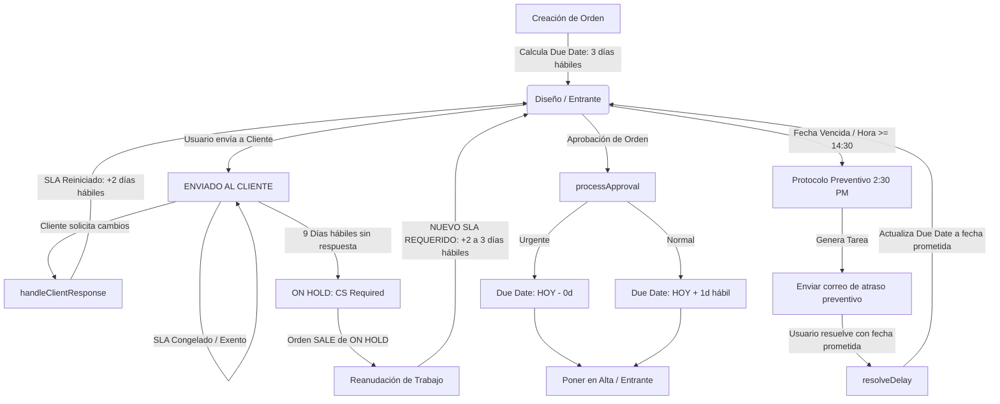

# Especificación Técnica y Auditoría del Sistema SLA (Service Level Agreement)

> **Estado**: Documento de Auditoría y Especificación de Requerimientos  
> **Fecha**: Octubre 2026  
> **Propósito**: Describir la arquitectura actual, fórmulas de cálculo, disparadores (triggers), comportamientos, validación con el usuario y especificación de cambios requeridos para el SLA en **KUDOSDOES**.

---

## 1. Visión General de la Arquitectura SLA

El sistema SLA en **KUDOSDOES** gestiona los tiempos de respuesta, compromisos de entrega y estado de vencimiento de las órdenes de trabajo (`orders`).

### 1.1 Estructura de Datos Central

| Campo / Tabla | Tipo | Descripción |
| :--- | :--- | :--- |
| `orders.start_date` | `date` | Fecha en la que inició el trabajo activo en la orden. |
| `orders.original_due_date` | `date` | Fecha de entrega calculada originalmente al crear la orden. |
| `orders.current_due_date` | `date` | Fecha de entrega prometida / calculada vigente. |
| `orders.last_meaningful_update` | `datetime` | Última actualización significativa de avance o estatus. |
| `orders.last_sent_to_client_at` | `datetime` | Fecha/hora del último envío de pruebas o propuesta al cliente. |
| `orders.approved_at` | `datetime` | Estampa de tiempo en la que la orden fue aprobada por el cliente o Camila. |
| `orders.client_revision_count` | `integer` | Número de ciclos de revisión acumulados con el cliente. |
| `orders.internal_revision_count` | `integer` | Número de correcciones internas realizadas. |
| `orders.flags` | `json / array` | Etiquetas globales dinámicas (`URGENTE`, `OVERDUE`, `ALMOST OVERDUE`, etc.). |
| `due_date_histories` | `tabla` | Auditoría de cambios de fecha (`previous_due_date`, `new_due_date`, `reason`, `trigger_event`, `client_promised_date`, `created_by`). |
| `order_events` | `tabla` | Eventos de línea de tiempo (`DUE_DATE_CHANGED`, `DELAY_RESOLVED`, `ORDER_APPROVED`, etc.). |

---

## 2. Reglas del Negocio y Constantes (Actualizado según Confirmación del Usuario)

```php
public const DESIGN_BASE_SLA_DAYS = 3;       // 3 días hábiles para órdenes de diseño base
public const CLIENT_CHANGES_SLA_DAYS = 2;    // 2 días hábiles tras recibir cambios del cliente
public const RESUME_FROM_HOLD_SLA_DAYS = 2;   // 2 a 3 días hábiles al reanudar una orden desde ON HOLD
public const CLIENT_FOLLOWUP_INTERVAL_DAYS = 3; // Intervalo de 3 días para seguimiento a cliente
public const ON_HOLD_NO_RESPONSE_DAYS = 9;   // 9 días hábiles sin respuesta envían orden a ON HOLD
```

> 📌 **Nota sobre `MISSING_MEASURES_SLA_DAYS`**: Se eliminará de la configuración por solicitud explícita del usuario.

### 2.1 Umbrales Horarios y Protocolo Preventivo de Atención
* **14:30 (2:30 PM) - Protocolo Preventivo Transparente**: A partir de las 2:30 PM, si una orden vence hoy y no ha sido marcada como completada, el sistema genera automáticamente la tarea urgente *"Enviar correo de atraso preventivo"*.  
  * **Propósito Validado**: Permitir al equipo contactar activamente al cliente **antes** del vencimiento oficial para acordar una nueva fecha de entrega, garantizando un servicio al cliente activo y transparente.
* **16:00 (4:00 PM) - Cierre Oficial de Entrega**: Si la orden vence hoy y llega a las 4:00 PM sin completarse, su estado pasa oficialmente a **`OVERDUE`**.
* **16:30 (4:30 PM) - Corte Correo de Bienvenida**: Si la orden ingresa pasadas las 4:30 PM o en fin de semana, la tarea de bienvenida se programa para el siguiente día hábil.

---

## 3. Lógica de Exenciones (`isSlaExempt`) y Filosofía por Estatus

### 3.1 Exención de SLA (`isSlaExempt`)
Una orden **congela su reloj de SLA** únicamente si se cumple cualquiera de las siguientes condiciones:
1. `done_today === true` (la orden fue completada hoy).
2. `in_workspace === false` (fuera del workspace o archivada).
3. `isPaused() === true` (`substatus === Substatus::PAUSADO`).
4. `core_status` está en un estatus verdaderamente exento/congelado:
   * `CoreStatus::ENVIADO_AL_CLIENTE`
   * `CoreStatus::EN_PRODUCCION`
   * `CoreStatus::ON_HOLD`
   * `CoreStatus::ARCHIVED`

### 3.2 Estatus `ENVIADO_A_CAMILA` (Revisión Interna)
* **Regla Confirmada**: `ENVIADO_A_CAMILA` **NO es exento de SLA**.
* **Razón de Negocio**: Camila representa un filtro de revisión interna. Aunque la orden esté con Camila, la fecha de compromiso de entrega al cliente **no cambia**. Por lo tanto, el reloj de SLA sigue corriendo hacia la fecha objetivo pactada con el cliente.

---

## 4. Auditoría de Reanudación desde `ON HOLD` (Respuesta a la Pregunta del Usuario)

> ❓ **Pregunta del Usuario**: *"Cuando una orden está en ON HOLD y SALE del core status ON HOLD, ¿debería dispararse un nuevo SLA de 2-3 días ya que el diseñador debe retomar la orden? ¿Esto está pasando?"*

### 🔍 Resultado de la Auditoría Técnica: **NO, ESTO NO ESTÁ PASANDO ACTUALMENTE.**

#### Diagnóstico del Código Actual:
1. Cuando una orden entra a `CoreStatus::ON_HOLD`, `isSlaExempt()` pasa a ser `true` y detiene las alertas de vencimiento. Sin embargo, la columna `current_due_date` **mantiene la fecha antigua** que tenía antes de congelarse.
2. En `AutomationEngine::handleStatusChanged`, **no existe ningún bloque de código que detecte cuando `$previousStatus === CoreStatus::ON_HOLD`** para recalcular o extender la fecha de entrega.
3. Cuando la orden sale de `ON_HOLD` (por ejemplo, al moverla a la cola del diseñador o a `TO DO TODAY`), `isSlaExempt()` vuelve a ser `false`.
4. Dado que la `current_due_date` conservó su valor anterior (que típicamente ya venció durante los días que la orden estuvo pausada), la orden **pasa a estar `OVERDUE` de forma inmediata e injusta** en el instante exacto en que sale de `ON HOLD`.

#### 🛠️ Solución Requerida al Implementar:
Cuando una orden cambie de `CoreStatus::ON_HOLD` a cualquier cola de trabajo activa (cola de diseñador o `TO_DO_TODAY`), `AutomationEngine` debe recalcular automáticamente un **nuevo SLA de 2 a 3 días hábiles** partiendo del día actual (`now() + 2/3 weekdays`) y registrar la actualización mediante `SlaEngine::updateDueDate` con el motivo *"Orden reanudada desde ON HOLD - Nuevo SLA asignado para retomar trabajo"*.

---

## 5. Mapa de Triggers y Flujos de Trabajo



---

## 6. Resumen de Inconsistencias y Ajustes Confirmados

| Asunto | Estado / Comportamiento Actual | Decisión / Solución Requerida |
| :--- | :--- | :--- |
| **Salida de `ON HOLD`** | Mantiene fecha antigua vencida; pasa a `OVERDUE` de inmediato. | **Implementar cálculo de nuevo SLA (2-3 días hábiles)** al salir de `ON HOLD`. |
| **`MISSING_MEASURES_SLA_DAYS`** | Constante de 2 días hábiles en `ENTRANTE`. | **Eliminar** esta regla constante. |
| **Protocolo 2:30 PM vs 4:00 PM** | Tarea preventiva a las 2:30 PM; `OVERDUE` a las 4:00 PM. | **Mantener exactamente como está**. Es el comportamiento preventivo deseado. |
| **`ENVIADO_A_CAMILA`** | No exento en `isSlaExempt()`, mantiene fecha original. | **Mantener como NO exento**. Camila es un filtro interno; el SLA no cambia. |
| **Edición Manual de Fecha** | Edición en modal no usa `SlaEngine::updateDueDate()`. | **Centralizar** toda edición manual vía `SlaEngine::updateDueDate()` para registrar historial. |

---

## 7. Próximos Pasos

1. Confirmar la cantidad exacta de días hábiles deseada al salir de `ON HOLD` (¿2 días hábiles o 3 días hábiles?).
2. Proceder con la implementación de los cambios en el código cuando indiques que se puede iniciar.
