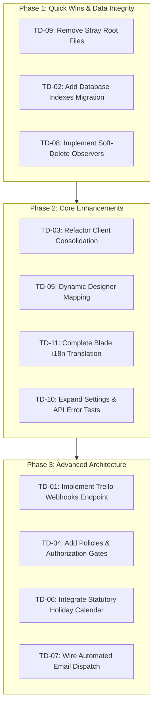

# Technical Debt & Pending Features Inventory

> **Project:** Kudos Design Ops — Trello Workflow Manager (KUDOSDOES)  
> **Date:** September 2026  
> **Location:** `docs/tech-debt/tech-debt-inventory.md`  

---

## 1. Executive Summary

This document presents a comprehensive audit of the **Kudos Design Ops** codebase (`KUDOSDOES`). It outlines technical debt items, incomplete features, and performance optimizations. 

Each item below includes both an **engineering technical description** and a **💡 Non-Technical Explanation (What this means for you)** so that both developers and non-technical team members can understand the impact and priority of each item.

---

## 2. Technical Debt Summary Table

| ID | Category | Item Title | Severity | Non-Technical Summary (What it affects) |
|---|---|---|---|---|
| **TD-01** | Architecture & Sync | Trello Real-Time Webhook Ingestion | **High** | Changes made in Trello take up to 15 minutes to show in the app instead of updating instantly. |
| **TD-02** | Database & Performance | Missing Composite Indexes on Orders & Tasks | **High** | Screens could slow down as the number of orders grows over time. |
| **TD-03** | Data Integrity | Client Consolidation Command Destructive Wipes | **High** | Running client cleanup can accidentally delete manually entered client contacts/links. |
| **TD-04** | Security & Auth | Missing Route Middleware & Policy Authorization Gates | **High** | All users currently have access to admin actions like deleting orders or downloading backups. |
| **TD-05** | Domain Logic | Hardcoded Designer & Staff Logic | **Medium** | Team member names are typed into the code; adding or changing team members requires code edits. |
| **TD-06** | SLA & Business Days | Absence of Holiday / Non-Working Calendar Support | **Medium** | Due dates skip weekends but don't automatically account for statutory/public holidays. |
| **TD-07** | Integrations | Automated External Communication / Email Dispatch | **Medium** | "Send Welcome Email" creates a reminder task, but doesn't actually send the email automatically. |
| **TD-08** | Data Integrity | Cascading Soft Delete Handling for Related Models | **Medium** | Deleting an order leaves its subtasks sitting silently in the background. |
| **TD-09** | Housekeeping | Stray Command Output Files in Project Root | **Low** | 3 leftover clutter files sit in the main folder from previous test scripts. |
| **TD-10** | Testing | Test Suite Coverage Gaps for Settings & Failure Modes | **Low** | Settings screens lack automated tests to catch bugs before users spot them. |
| **TD-11** | Frontend / i18n | Hardcoded Raw Strings in Blade Views | **Low** | Some buttons remain in Spanish even if the user switches the app language to English. |
| **TD-12** | UX / Mobile | Mobile Drag-and-Drop Constraints | **Low** | Dragging cards on Kanban/Planner screens is tricky on mobile phone touchscreens. |

---

## 3. Detailed Breakdown of Technical Debt & Incomplete Items

### TD-01: Trello Real-Time Webhook Ingestion
- **Severity:** **High**
- **Current State:** The system synchronizes with Trello via scheduled console polling (`Schedule::command('trello:sync')->everyFifteenMinutes()`) or manual triggers in the UI.
- **Missing / Tech Debt:** Real-time webhooks (`POST /api/trello/webhook`) are not implemented. Changes made in Trello can take up to 15 minutes to reflect in the web application.
- **Recommended Action:** Create a webhook receiving endpoint with signature verification, register webhooks via the Trello API, and dispatch sync jobs asynchronously upon payload arrival.
- **💡 Non-Technical Explanation (What this means for you):**  
  Right now, the app checks Trello every 15 minutes. If someone moves a card or updates a task in Trello, it won't show up in the web app immediately unless you wait up to 15 minutes or click "Sync". Adding webhooks will make updates happen **instantly** the second someone moves a card in Trello.

---

### TD-02: Missing Composite Indexes on Orders & Tasks
- **Severity:** **High**
- **Current State:** Basic primary and foreign key indexes exist, but high-frequency query patterns in `Order::scopeInWorkspace()`, `Order::scopeActiveInWorkspace()`, and `Order::scopeSearch()` perform unindexed filtering.
- **Missing / Tech Debt:**
  - `orders` table lacks composite indexes on `(in_workspace, core_status)`, `(designer_id, core_status)`, `(is_missing_from_trello)`, and `(archived_at)`.
  - `related_tasks` table lacks composite indexes on `(scheduled_date, status)` and `(order_id, status)`.
- **Recommended Action:** Add a migration creating targeted multi-column indexes for frequently filtered columns.
- **💡 Non-Technical Explanation (What this means for you):**  
  Think of a database index like an index at the back of a textbook. Right now, when the app loads your "To Do Today" cards or searches for orders, it has to scan through every single order line-by-line. As your database grows to thousands of orders, screens could start feeling sluggish. Adding indexes gives the app a quick lookup shortcut so pages load instantly.

---

### TD-03: Client Consolidation Command Destructive Wipes
- **Severity:** **High**
- **Current State:** `app/Console/Commands/ConsolidateClientsCommand.php` handles clean client matching by running:
  ```php
  ClientLocation::query()->forceDelete();
  ClientContact::query()->delete();
  ClientLink::query()->delete();
  Client::query()->forceDelete();
  ```
- **Missing / Tech Debt:** If an administrator or account rep manually adds contacts, custom links, or phone numbers to a client via the UI, running `php artisan clients:consolidate` permanently deletes those records.
- **Recommended Action:** Refactor `ConsolidateClientsCommand` to merge records non-destructively or add a flag preserving user-created contacts and links. Also build a visual Client Deduplication/Merge UI in `ClientIndex`.
- **💡 Non-Technical Explanation (What this means for you):**  
  There is a backend cleanup tool used to organize company and client names. However, running this tool currently wipes out all custom client contacts, links, or phone numbers entered manually through the app UI. Updating this tool will protect your manually entered client data from being erased during cleanup.

---

### TD-04: Missing Route Middleware & Policy Authorization Gates
- **Severity:** **High**
- **Current State:** Routes defined in `routes/web.php` do not attach an `auth` middleware, and Livewire component methods (e.g. deleting orders, downloading DB backups, modifying subtask presets) lack `authorize()` checks or Laravel Policy guards.
- **Missing / Tech Debt:** Any authenticated user (or unauthenticated request if auth middleware is disabled) can perform administrative operations.
- **Recommended Action:** Define Laravel Policies (`OrderPolicy`, `ClientPolicy`, `BackupPolicy`) and authorize actions within Livewire components.
- **💡 Non-Technical Explanation (What this means for you):**  
  Currently, any person using the app has permission to click high-level admin buttons—like permanently deleting orders, changing global settings, or downloading database backups. Adding role permissions and security gates will ensure only authorized team leaders/admins can perform sensitive operations.

---

### TD-05: Hardcoded Designer & Staff Logic
- **Severity:** **Medium**
- **Current State:** Designer names ("Euralíz", "Adrián", "César") and supervisor names ("Camila") are hardcoded in string matching conditionals across `TrelloSyncService.php`, `AutomationEngine.php`, `AppBehaviorsDocs.php`, and `Board.php`.
- **Missing / Tech Debt:** If team staffing changes, list mappings or column structures change, or new designers join, logic across multiple services will break or require manual code modifications.
- **Recommended Action:** Store designer-to-list mappings and supervisory roles dynamically in the `designers` database table or configuration files, using foreign keys and dynamic string matching.
- **💡 Non-Technical Explanation (What this means for you):**  
  Specific team member names (like Euralíz, Adrián, César, and Camila) are written directly into the app's internal code rules. If a team member changes, changes their name, or a new designer is hired, a developer currently has to modify code in several places. Making this dynamic will let you add or edit team members directly from an easy settings screen.

---

### TD-06: Absence of Statutory Holiday / Non-Working Calendar Support
- **Severity:** **Medium**
- **Current State:** `SlaEngine.php` calculates due dates using Carbon's `addWeekdays()`, which accounts for Saturdays and Sundays.
- **Missing / Tech Debt:** Company holidays, statutory public holidays, or custom team days off are not subtracted from SLA countdowns.
- **Recommended Action:** Introduce a `holidays` configuration table or service that allows defining non-working dates, and integrate it into `SlaEngine`.
- **💡 Non-Technical Explanation (What this means for you):**  
  When the app calculates delivery deadlines (SLAs), it automatically skips Saturdays and Sundays. However, it doesn't know about official public holidays (like New Year's Day, Christmas, or local holidays). Adding a holiday calendar will prevent deadlines from landing on official days off.

---

### TD-07: Automated External Communication / Email Dispatch Integration
- **Severity:** **Medium**
- **Current State:** `AutomationEngine` generates `RelatedTask` records such as `ENVIAR CORREO DE BIENVENIDA` or `SOLICITAR INFORMACIÓN`.
- **Missing / Tech Debt:** These tasks exist strictly as operational checklist items in the database. There is no automated email dispatch layer (via Mailables, SendGrid, Mailgun, or Postmark) to automatically send the welcome email or client information request.
- **Recommended Action:** Implement optional automated email dispatch handlers bound to `RelatedTask` creation events.
- **💡 Non-Technical Explanation (What this means for you):**  
  When a new order comes in, the app creates a checklist task like "Send Welcome Email". But right now, a team member still has to manually open their email app, write the email, and click send. Wiring up email automation will allow the app to send those initial emails automatically for you.

---

### TD-08: Cascading Soft Delete Handling for Related Models
- **Severity:** **Medium**
- **Current State:** The `Order` model uses `SoftDeletes`. However, soft-deleting an `Order` does not automatically update or soft-delete its child `related_tasks`, `order_events`, or `due_date_histories`.
- **Missing / Tech Debt:** Orphaned subtasks remain active in queries that do not explicitly join `orders` or check `whereHas('order')`.
- **Recommended Action:** Add model observers or Eloquent event listeners on `Order` to cascade soft-deletes and restores to child models.
- **💡 Non-Technical Explanation (What this means for you):**  
  When an order is deleted, its subtasks and history records stay saved in the background system memory. Updating this behavior ensures that when an order is deleted, all of its subtasks are neatly deleted/archived right alongside it so nothing gets left behind.

---

### TD-09: Stray Command Output Files in Project Root
- **Severity:** **Low**
- **Current State:** Three stray artifact files exist in the project root directory:
  - `company_name} | Task: {-`
  - `task_name} | Title: {-`
  - `trello_title} | Workspace: " . ($r->in_workspace ? "YES" : "NO") . " | Scheduled: {-`
- **Missing / Tech Debt:** These files were created by accidental shell output redirection (`>`) during previous CLI commands.
- **Recommended Action:** Safely delete these 3 leftover files from the root directory.
- **💡 Non-Technical Explanation (What this means for you):**  
  There are 3 accidental clutter text files sitting in the app's top-level project folder from an earlier test script. Deleting them is simple digital housekeeping to keep the folder clean.

---

### TD-10: Test Suite Coverage Gaps for Settings & Failure Modes
- **Severity:** **Low**
- **Current State:** 189 tests cover core workflow rules, SLA engine, Trello sync, and Livewire components.
- **Missing / Tech Debt:**
  - Settings views (`Backups`, `Documentation`, `SubtaskPresets`, `Substatuses`) lack dedicated feature test coverage.
  - Trello API edge cases (rate limits, HTTP 429, HTTP 500 errors, network timeouts) are not tested with HTTP mocks.
- **Recommended Action:** Write feature tests for settings components and add HTTP failure mock tests for `TrelloSyncService`.
- **💡 Non-Technical Explanation (What this means for you):**  
  The app has 189 automated quality checks (tests) that run every time changes are made. However, we don't yet have automated tests specifically checking the Settings screens or simulating what happens if Trello's website breaks. Adding these extra tests guarantees that system settings won't break unexpectedly.

---

### TD-11: Hardcoded Raw Strings in Blade Views
- **Severity:** **Low**
- **Current State:** While many components use `__('...')`, several Blade components and Livewire views contain hardcoded Spanish text strings without translation helpers.
- **Missing / Tech Debt:** Switch to English locale (`/set-locale/en`) leaves portions of the UI un-translated.
- **Recommended Action:** Audit Blade views and wrap all user-facing strings in `__('...')` calls, ensuring corresponding keys exist in `lang/en.json` and `lang/es.json`.
- **💡 Non-Technical Explanation (What this means for you):**  
  A few buttons and labels on the screen have Spanish words typed directly into their visual templates instead of using the translation dictionary. If a user switches the app language to English, those specific buttons will still display in Spanish.

---

### TD-12: Mobile Drag-and-Drop Constraints
- **Severity:** **Low**
- **Current State:** The Kanban Board (`app/Livewire/Kanban/Board.php`) and Weekly Planner (`app/Livewire/Planner/WeeklyPlanner.php`) rely on HTML5 native drag-and-drop events (`wire:sort`, `dragstart`, `drop`).
- **Missing / Tech Debt:** Touch devices (smartphones, tablets) do not natively support HTML5 drag events without touch polyfills or touch fallback controls.
- **Recommended Action:** Add touch drag polyfills (e.g. SortableJS touch handling) or fallback modal dropdown actions for moving cards on touch screens.
- **💡 Non-Technical Explanation (What this means for you):**  
  Dragging cards between columns works great on desktop computers using a mouse. However, on mobile phone touchscreens or iPads, dragging items can feel awkward or unresponsive. Adding touch controls will make moving cards on phones smooth and effortless.

---

## 4. Recommended Remediation Roadmap



---

## 5. Conclusion & Maintenance

This documentation resides in `docs/tech-debt/tech-debt-inventory.md`. Whenever tech debt items are addressed or new architectural debt is identified, update this document to maintain a single source of truth for engineering priorities.
